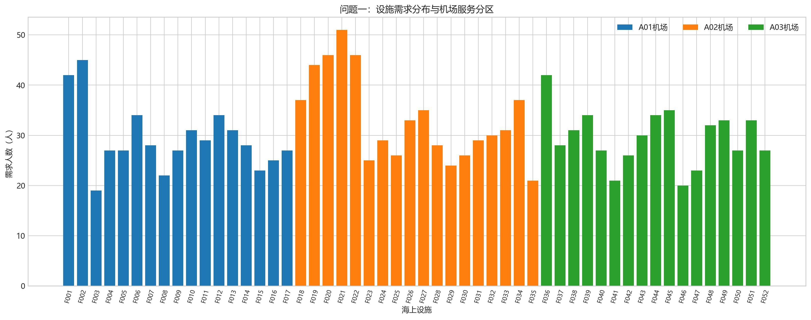
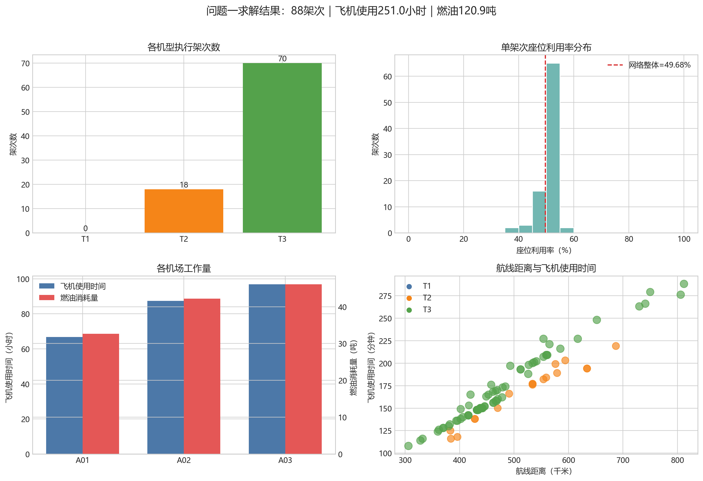
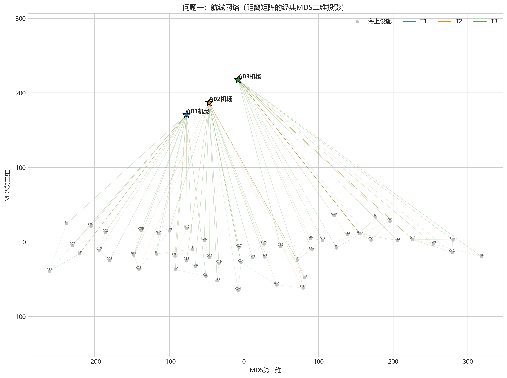

# B题问题一 Python 求解与代码讲解

## 1. 文件说明

本文件夹中与问题一有关的文件如下：

| 文件 | 作用 |
|---|---|
| `q1_solver.py` | 完整求解程序：读取数据、枚举候选架次、求解整数规划、校验燃油、分配人员、统计指标和绘图 |
| `q1-routes.csv` | 按题目附录格式生成的架次与停靠顺序结果，可直接用于结果提交 |
| `q1-assignments.csv` | 按题目附录格式生成的 1600 名人员乘机分配结果，可直接用于结果提交 |
| `q1_metrics.csv` | 五项核心指标、LP 下界、相对差距和运行时间 |
| `q1_flight_summary.csv` | 每个架次的机场、机型、人数、距离、时间、油耗、加油次数及路线 |
| `q1_facility_summary.csv` | 每个海上设施的需求人数、归属机场及服务架次数 |
| `问题一_设施需求分布图.png` | 52 个设施的需求量及机场分块图 |
| `问题一_航线网络图.png` | 根据距离矩阵进行经典 MDS 降维后绘制的航线网络示意图 |
| `问题一_求解结果综合图.png` | 机型、机场工作量、座位利用率和航程时间的综合结果图 |

## 2. 运行方法

在项目根目录运行：

```powershell
python code/q1_solver.py
```

程序依赖：

```text
Python 3.9+
pandas
numpy
scipy >= 1.9
matplotlib
```

程序不依赖 PuLP、CBC 或 OR-Tools，整数规划直接使用 `scipy.optimize.milp` 内置的 HiGHS 求解器。

## 3. 数据与建模预处理

### 3.1 输入数据

程序读取：

- `peopleQ1.csv`：1600 名出海人员的人员编号、陆地起点和海上终点；
- `distances.csv`：3 个机场和 52 个设施之间的距离矩阵。

### 3.2 LAND 人员的机场归属

按照 `model/第一问建模.md`，将设施按编号分为三个连续区域：

- `F001`—`F017` 由 `A01` 服务，共 499 人；
- `F018`—`F035` 由 `A02` 服务，共 598 人；
- `F036`—`F052` 由 `A03` 服务，共 503 人。

数据检查表明，所有已经指定机场的人员都与该分块一致，因此不会违反固定起飞机场约束。`LAND` 人员采用其目的设施所属机场。



## 4. 核心数学模型

### 4.1 需求拆分

对设施 $d$ 的需求人数 $q_d$，分别按 T1、T2、T3 的座位数 $c\in\{12,16,19\}$ 构造三种拆分方案：

$$
n_{d,c}=\left\lfloor\frac{q_d}{c}\right\rfloor,
\qquad
p_{d,c}=q_d-c n_{d,c}.
$$

其中：

- $n_{d,c}$ 是满座架次数；
- $p_{d,c}$ 是需要与其他设施尾数合并运输的人数；
- 每个设施必须且只能选择一种拆分方案。

满座部分采用单设施架次；尾数部分可以将不超过 5 个不同设施合并进一个架次，且总人数不能超过所选机型的座位数。

### 4.2 集合划分整数规划

设 $y_s$ 表示是否选择某设施的拆分方案 $s$，$x_r$ 表示是否采用候选尾数合并架次 $r$。模型为：

$$
\min \sum_s C_s^{\mathrm{full}}y_s+\sum_r C_r x_r,
$$

约束包括：

1. 每个设施恰好选择一个拆分方案；
2. 被选择方案中的非零尾数必须且只能由一个尾数架次覆盖；
3. 每个尾数架次最多停靠 5 次；
4. 每个尾数架次人数不超过机型座位数；
5. 每条最终路线必须满足安全余油约束。

目标成本首先使用整数分钟。程序加入极小的油耗权重：

$$
C=T+10^{-8}F,
$$

因此任何 1 分钟的时间改善都严格优先于油耗；只有总飞机使用时间相同时，才倾向选择油耗较低的方案。

## 5. 路线、时间与燃油计算

### 5.1 整数分钟

对距离为 $d$、速度为 $v_m$ 的航段，飞行时间为：

$$
t_{ij}=\left\lceil\frac{60d_{ij}}{v_m}\right\rceil.
$$

不加油停靠计 10 分钟，加油停靠计 20 分钟。最终返回机场不另计停靠时间。

### 5.2 安全余油

三种机型最大连续不加油航程为：

| 机型 | 座位数 | 最大连续航程 |
|---|---:|---:|
| T1 | 12 | 250.00 km |
| T2 | 16 | 400.00 km |
| T3 | 19 | 482.76 km |

程序用标签搜索求解单架次的最优可行路线。一个状态包含：

```text
当前位置、已经访问的必达设施、已用着陆次数、上次加油后的累计航程
```

搜索过程中：

- 到达任一地点时，累计航程不能超过该机型最大连续航程；
- 在 8 个加油设施可以选择加满油；
- 为完成远端往返，允许再次访问同一加油设施；
- 所有海上实际停靠，包括纯加油停靠，均计入最多 5 次着陆；
- 采用 Pareto 支配规则删除“时间更长且剩余航程更差”的状态。

## 6. 延迟精确化求解策略

如果对数万条候选尾数架次都立即进行完整燃油路线搜索，计算量较大。程序采用“先乐观估价，再精确化被选列”的方法：

1. 忽略燃油约束，对每个候选设施集合枚举不超过 5 个设施的访问排列，得到乐观路线成本；
2. 使用乐观成本求解集合划分 MILP；
3. 只对当前整数解中被选中的尾数架次执行完整燃油路线搜索；
4. 将这些列的成本更新为真实可行成本，不可行列直接禁用；
5. 重新求解 MILP，直到最终选中的所有列都已经精确化。

该方法不仅是启发式。未精确化列的成本是其真实成本的下界；当最终解中的所有已选列都使用真实成本，而且在所有乐观列参与竞争时仍为最优，就不存在真实成本更低的替代解。因此，在“固定机场分块 + 当前拆分粒度”的模型内，最终整数解具有下界证明。

三个机场分别枚举的尾数候选架次数为：

| 机场 | 候选尾数架次数 | 最终尾数架次数 |
|---|---:|---:|
| A01 | 20,350 | 8 |
| A02 | 38,306 | 10 |
| A03 | 37,714 | 8 |

## 7. 代码结构讲解

### 7.1 `RouteResult`、`SplitOption`、`TailColumn`、`Flight`

这四个数据类分别保存：

- 一条具体可行路线；
- 一个设施的拆分方案；
- 一条集合划分候选列；
- 最终用于输出和人员分配的实际架次。

### 7.2 `nominal_route()`

对至多 5 个必访设施枚举所有排列，计算忽略燃油时的最短环游。结果按“整数分钟、油耗、距离”排序，并使用缓存避免重复计算相同设施集合。

### 7.3 `best_feasible_route()`

执行带燃油状态的标签搜索。它是整个程序中负责保证路线真实可行的关键函数，返回：

- 完整节点序列，含首末机场；
- 每次停靠是否加油；
- 总整数分钟；
- 总距离和总油耗。

### 7.4 `enumerate_tail_columns()`

从同一机场的设施中选择 1—5 个不同设施，再枚举各设施的三种拆分尾数。仅保留总人数不超过 19 的组合，并为组合选择当前最快的可载机型。

### 7.5 `build_milp()` 与 `solve_airport()`

`build_milp()` 使用稀疏矩阵构造集合划分模型，`solve_airport()` 调用 HiGHS 求整数解并执行多轮路线精确化。三个机场独立求解后再汇总。

### 7.6 `construct_flights_and_assignments()`

将选中的满座架次和尾数架次展开为真实航班：

- 为每种机型生成从 1 开始连续的 `flight_no`；
- 将每名人员分配到唯一架次；
- 出海人员的 `pickup_stop_order` 恒为 0；
- `delivery_stop_order` 为路线中第一次到达其目的设施的序号。

### 7.7 `calculate_metrics()`

逐航段计算：

- 总飞机使用时间；
- 每名人员到达目的设施前的在途时间；
- 总燃油消耗量；
- 客座公里与可用座公里；
- 网络座位利用率。

人员在目的设施到达时结束计时，因此不包含其下机设施的停靠时间，但包含到达前的所有绕行、飞行和中间停靠时间。

### 7.8 `validate()`

输出前自动检查：

1. 1600 人全部且仅分配一次；
2. 固定机场人员从指定机场起飞；
3. 每架次首末为同一机场；
4. 每架次海上停靠不超过 5 次；
5. 只有指定设施可以加油；
6. 每一段到达后的油量都不低于安全余油；
7. 每一航段机上人数不超过机型座位数；
8. 下机点是上机后第一次到达该人员目的地的位置；
9. 每种机型的架次号从 1 开始连续。

## 8. 求解结果

### 8.1 五项核心指标

| 指标 | 结果 |
|---|---:|
| 总飞机使用时间 | **15,061 分钟（251.02 小时）** |
| 人员总在途时间 | **131,033 分钟（2,183.88 人·小时）** |
| 总架次数 | **88 架次** |
| 总燃油消耗量 | **120,920.10 kg** |
| 座位利用率 | **49.68%** |

此外：

- 总加油次数：38 次；
- LP 乐观下界：15,041.00 分钟；
- 相对差距：约 0.133%；
- 本次运行用时：约 110.72 秒。

座位利用率按题目定义计算的是全航段客座公里比。出海运输返回机场的航段通常为空载，因此即使出发时接近满座，网络座位利用率也会接近 50%，本结果符合单向运输的结构特征。

### 8.2 分机场与机型结果

| 机场 | 人数 | 架次数 | 飞机时间/min | 油耗/kg |
|---|---:|---:|---:|---:|
| A01 | 499 | 27 | 4,004 | 32,660.9 |
| A02 | 598 | 33 | 5,245 | 42,167.1 |
| A03 | 503 | 28 | 5,812 | 46,092.1 |
| 合计 | 1,600 | 88 | 15,061 | 120,920.1 |

机型构成为：

- T1：0 架次；
- T2：18 架次，运输 287 人；
- T3：70 架次，运输 1,313 人。

T1 虽速度最快，但座位少、单位距离油耗最高且最大连续航程最短；在本数据和“总飞机使用时间优先”的目标下，拆分增加的架次与加油停靠抵消了速度优势，因此最终未被采用。



### 8.3 航线网络

由于附件只给出距离矩阵，没有给出经纬度，`问题一_航线网络图.png` 使用经典多维尺度分析（Classical MDS）把 55×55 距离矩阵映射到二维平面。该图用于展示路线连接结构，不应解释为真实地图坐标。



## 9. 输出文件使用建议

- 论文正文中的五项指标可直接引用本文件第 8.1 节；
- 详细架次表引用 `q1_flight_summary.csv`；
- 提交或附录使用 `q1-routes.csv` 和 `q1-assignments.csv`；
- 若修改机型参数、机场分块或停靠规则，只需修改 `q1_solver.py` 顶部的常量后重新运行；
- 重新运行会覆盖同名结果文件和图片。

## 10. 模型边界

本程序严格实现当前第一问建模文档的两项简化：

1. `LAND` 人员按设施编号分块固定到机场，没有把 52×3 的机场选择变量纳入总模型；
2. 每个设施先拆出若干满座单设施架次，只对三种拆分方案的尾数进行跨设施合并。

因此“接近全局最优”的含义是：在上述固定分块和拆分结构内，整数解与 LP 下界仅相差约 0.133%。如果要进一步搜索原始问题的绝对全局最优，可把 LAND 机场选择和任意人数拆分一并纳入列生成模型，但计算复杂度会显著增加。
