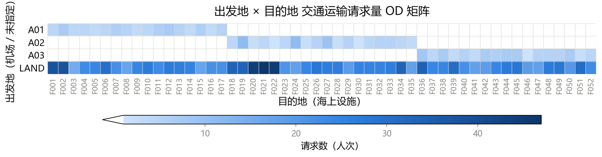

# 问题一：单向出海运输的直升机运载计划编排

## 1. 问题重述

给定 1600 条**出海**需求（`peopleQ1.csv`），每名人员有一个起点（`A01/A02/A03` 或 `LAND`）和终点（`F001`~`F052`）。需编排直升机架次，把人员从陆地机场运送到海上设施。本问**不考虑**最早可登机时间、最晚到达时间和业务性质优先级，且**飞机数量充足**。

要求：在**最小化总飞机使用时间**的基础上，尽可能优化座位利用率、油耗等次要因素，输出 `q1-routes.csv` 与 `q1-assignments.csv`，并报告总飞机使用时间、人员总在途时间、总架次数、总燃油消耗量、座位利用率五项指标。

## 2. 问题本质与建模思路

### 2.1 问题抽象

从运筹学角度看，问题一是一个**多机场、多机型、带容量与燃油约束的单向车辆路径问题**（CVRP 的变体）。与经典 VRP 的差异在于：

1. **单向运送**：架次只执行"机场 → 若干海上设施 → 原机场"的环游，人员只下不上（出海方向），故无需考虑返程载客。
2. **人员不可换乘**：每名人员必须由同一架次从其起点直接送到终点，中途不得换机。
3. **多机型**：T1/T2/T3 的座位数、速度、油耗、航程均不同，机型是决策变量而非固定参数。
4. **燃油约束**：满油起飞、全程剩余油量不低于最低安全余油量，可在 8 个可加油设施中途加油（加满）。
5. **停靠次数上限**：每架次最多 5 次海上着陆（加油停靠也计入着陆次数）。

### 2.2 目标函数的本质

一架次总时间 = 飞行时间 + 停靠时间：

$$
T_r = \frac{d_r^{\text{TSP}}}{v_m} + 10\,|S_r| + 10\,g_r \;(\text{分钟})
$$

其中 $d_r^{\text{TSP}}$ 为该架次的环游飞行距离（由访问顺序决定），$v_m$ 为机型速度，$|S_r|$ 为海上停靠次数（每次 10 分钟），$g_r$ 为其中加油的停靠次数（加油停靠比普通停靠多 10 分钟，即每次 20 分钟）。

由于设施间平均距离（180 km）**小于**机场到设施的平均距离（254 km），把地理相邻的设施合并进同一个架次能省去多次"机场往返"，这是优化空间所在；而合并受到座位数（≤19）与停靠次数（≤5）的双重约束。因此问题一的本质是：**在容量与航程约束下，对设施进行聚类分组，每组一个架次做 TSP 环游并选机型，使总时间最小**。

## 3. 数据特征与关键洞察

对 `peopleQ1.csv`、`distances.csv` 分析得到以下结论。

### 3.1 需求分布（OD 矩阵）

图 1 为 1600 条出海需求按"出发地 × 目的地"聚合的 OD 矩阵热力图：

由图 1 可见：指定机场的 247 人按"三块"分布（A01→F001~F017、A02→F018~F035、A03→F036~F052），而 `LAND` 的 1353 人均匀覆盖 F001~F052。

| 项目 | 结论 |
|------|------|
| 需求规模 | 1600 人，指定机场 247 人 + `LAND` 1353 人 |
| 设施需求 | 52 个设施全部有需求，每设施 19~51 人，均值 30.8 |
| 机场自然分块 | F001~F017→A01、F018~F035→A02、F036~F052→A03，负载 499/598/503（均衡；编号顺序与海岸线走向一致，各段设施就近其对应机场） |
| 纯就近分配 | A01=944、A02=275、A03=381（严重失衡） |

### 3.2 机型续航能力

三种机型的续航参数见表 1，其中「可用燃油 = 油箱容量 − 最低安全余油量」「最大不加油航程 = 可用燃油 ÷ 油耗」：

| 机型 | 座位数 | 速度(km/h) | 油耗(kg/km) | 油箱容量(kg) | 最低安全余油(kg) | 可用燃油(kg) | 最大不加油航程(km) |
|:----:|:------:|:----------:|:-----------:|:------------:|:----------------:|:------------:|:------------------:|
| T1 | 12 | 250 | 3.4 | 1000 | 150 | 850 | 250 |
| T2 | 16 | 220 | 2.5 | 1150 | 150 | 1000 | 400 |
| T3 | 19 | 190 | 2.9 | 1600 | 200 | 1400 | ≈483 |

**续航能力对比**。机场到设施的最近单程距离为 153 km，最远 403 km。三种机型的最大不加油航程差异显著：

- **T1（250 km）**：航程最短，单程仅覆盖 35 个设施，其余设施须借助可加油设施加油；
- **T2（400 km）**：航程居中，单程覆盖绝大部分设施；
- **T3（483 km）**：航程最长，单程覆盖全部 52 个设施，但远端设施往返（$2\times 243$~$2\times 403$ = 486~806 km）仍超航程，须中途加油。

**燃油是硬约束**。A03 南端的 F037~F052 距机场 243~403 km，往返 486~806 km，超出 T3 的 483 km 航程，必须利用可加油设施（F038、F044、F050 等）中途加油。因此加油点的选择与插入是航线可行性的必要条件，具体处理见 §6.4 与 §7。

**机型选择与拆分**。三种机型各有优劣：T1 速度最快（250 km/h）但座位最少（12 座）、航程最短；T3 座位最多（19 座）、航程最长但最慢（190 km/h）；T2 居中。同一设施的需求可拆给不同机型（如 29 人拆成「10 人 T1 + 19 人 T3」优于纯 T2），故机型选择与需求拆分共同作为决策，由整数规划在 T1/T2/T3 中择优（见 §6.3）。

## 4. 模型假设

1. 人员上下机、地面调度时间忽略不计（题目未给出）。
2. 飞行速度与单位距离油耗不随载客量变化（题目给定）。
3. 忽略机场、设施、加油站的并发容量限制（题目给定）。
4. 停靠时间取最小：不加油 10 分钟、加油 20 分钟；时间向上取整到整数分钟。
5. 距离矩阵对称，且满足三角不等式（实际地理距离，可直接用于 TSP）。

## 5. 符号说明

**集合**

| 符号 | 含义 |
|------|------|
| $\mathcal{A}=\{A01,A02,A03\}$ | 机场集合 |
| $\mathcal{F}=\{F001,\dots,F052\}$ | 海上设施集合，$|\mathcal{F}|=52$ |
| $\mathcal{R}\subset\mathcal{F}$ | 可加油设施集合（8 个） |
| $\mathcal{M}=\{T1,T2,T3\}$ | 机型集合 |

**参数**

| 符号 | 含义 |
|------|------|
| $c_m,\ v_m,\ f_m,\ U_m,\ \underline{u}_m$ | 机型 $m$ 的座位数、速度(km/h)、油耗(kg/km)、油箱容量(kg)、最低安全余油量(kg) |
| $\bar d_m=\dfrac{U_m-\underline{u}_m}{f_m}$ | 机型 $m$ 的最大不加油航程(km) |
| $d_{uv}$ | 节点 $u,v\in\mathcal{A}\cup\mathcal{F}$ 间的距离(km)，对称 |
| $q_d$ | 设施 $d$ 的出海总人数（指定机场 + LAND 合计） |
| $\sigma(d)\in\mathcal{A}$ | 设施 $d$ 的归属机场（按编号分块，见 §6.2） |
| $\mathcal{F}_a=\{d:\sigma(d)=a\}$ | 机场 $a$ 服务的设施集合（分块后固定） |
| $q_{d,a}=q_d\,\mathbb{1}[\sigma(d)=a]$ | 机场 $a$ 服务设施 $d$ 的总人数（固定参数） |
| $D_d$ | 设施 $d$ 的候选拆分方案集合 |
| $c_s,\ n_s,\ p_s$ | 方案 $s$ 的满座机型座位数（$\in\{12,16,19\}$）、满座份数、尾数份人数 |

**决策变量**

| 符号 | 含义 |
|------|------|
| $y_s\in\{0,1\}$ | 是否选取设施 $d$ 的拆分方案 $s$ |
| $\lambda_r\in\mathbb{Z}_+$ | 尾数合并架次 $r$ 的使用次数 |

**架次与燃油**

| 符号 | 含义 |
|------|------|
| $r$ | 尾数合并架次索引 |
| $a_r,\ m_r$ | 架次 $r$ 的起飞机场、机型 |
| $S_r\subset\mathcal{F}$ | 架次 $r$ 访问的设施子集，$|S_r|$ 为海上停靠次数（$\le 5$） |
| $g_r$ | 架次 $r$ 的加油停靠次数（$0\le g_r\le|S_r|$） |
| $d_r^{\text{TSP}}$ | 架次 $r$ 的环游飞行距离(km) |
| $T_r$ | 架次 $r$ 的总时间(min) |
| $T^{\text{满}}(c)$ | 单设施满座份 $c$ 的单飞时间(min) |
| $s_i,\ u_i$ | 路线第 $i$ 个节点、到达该节点时的剩余油量(kg) |

**求解与指标**

| 符号 | 含义 |
|------|------|
| $z_{LP},\ z_{IP}$ | 集合划分 IP 的 LP 松弛下界、整数最优值 |
| $T=\sum_{d,s}y_s\,n_s\,T^{\text{满}}(c_s)+\sum_r T_r\lambda_r$ | 总飞机使用时间(min) |
| $\eta$ | 座位利用率 |

## 6. 数学模型

### 6.1 总体框架（可分解性）

完整求解分三层：**预处理**（§6.2 把 LAND 乘客归属到机场）、**单机场航线编排**（§6.3 拆分与集合划分、§6.4 燃油约束）、**汇总**（三机场结果相加）。

分解的依据在于架次不跨机场中转、人员不换乘、飞机数量充足：任一架次从某机场起飞、最终返回同一机场，全程只服务该机场周边的设施，不同机场的架次**互不牵扯**。于是把 LAND 乘客按 §6.2 的设施分块归属机场后，三个机场的调度彼此独立，总问题等价于三个子问题之和：

$$
\min \sum_{a\in\mathcal{A}} \text{VSP}(a)
$$

其中 $\text{VSP}(a)$ 为机场 $a$ 的航线编排子问题：给定设施集合 $\mathcal{F}_a$、各设施人数 $q_{d,a}$、机型与燃油参数，求总飞机使用时间最小的架次方案。三个子问题结构完全相同，只需对一个建模（§6.3、§6.4），其余机场套用同一程序即可。

### 6.2 LAND 分块固定分配（预处理）

设施编号 F001~F052 沿海岸线自北向南线性排列，与三个机场的位置分布一致，故按编号分三段即可同时实现"就近"与"均衡"：

$$
\sigma(d)=\begin{cases}
A01, & d\in\{F001,\dots,F017\}\\
A02, & d\in\{F018,\dots,F035\}\\
A03, & d\in\{F036,\dots,F052\}
\end{cases}
$$

设施 $d$ 的全部需求（含指定机场者与 LAND 者）统一由 $\sigma(d)$ 服务，于是各机场的设施集合 $\mathcal{F}_a$ 与人数 $q_{d,a}$ 均为**固定参数**：

$$
\mathcal{F}_a=\{d:\sigma(d)=a\},\qquad
q_{d,a}=\begin{cases}q_d, & \sigma(d)=a\\[2pt] 0, & \text{否则}\end{cases}
$$

三段负载分别为 499/598/503 人，均衡；且编号顺序与海岸线走向一致，各段设施就近其对应机场。分块方案在负载均衡与就近两方面都接近最优，故将其作为 LAND 乘客的机场归属。

这一步的实质是**把 LAND 的机场选择从决策变量退化为固定参数**：$q_{d,a}$ 事先算好，模型无需再对 1353 名 LAND 乘客逐一建立"去哪座机场"的约束，也无需引入 52×3 的分配变量，子问题规模大幅下降。代价是放弃了"设施分给非所属机场"的可能，详见 §10.1 的改进讨论。

### 6.3 航线编排子模型 $\text{VSP}(a)$（拆分 + 集合划分形式）

对机场 $a$，其服务的设施集合为 $\mathcal{F}_a$，设施 $d$ 需运送 $q_{d,a}$ 人。由于单机最多 19 座而每设施需求 19~51 人，任一设施都须由多架次共同运送（split delivery）。模型分两步：先把需求拆成"份"，再决定份如何组成架次。

**（1）拆分候选**。设施 $d$ 对每种满座机型 $c\in\{19,16,12\}$ 生成一个候选方案 $s=(c_s,n_s,p_s)$：

$$
n_s=\lfloor q_d/c_s\rfloor,\qquad p_s=q_d-c_s\,n_s
$$

含义：若该设施全部用 $c_s$ 座机型运送，需 $n_s$ 个满座架次（每架 $c_s$ 人），余下 $p_s$ 人（$0\le p_s<c_s$）为"尾数份"，由更小机型或与其他设施的尾数合并运送。例如 $q_d=29$：$c=19$ 得 $(19,1,10)$、$c=16$ 得 $(16,1,13)$、$c=12$ 得 $(12,2,5)$，三种方案构成候选集合 $D_d$。

**（2）满座架次**。满座份满载，单独飞对应机型即最优，成本为固定值：

$$
T^{\text{满}}(c)=\frac{2\,d_{a,d}}{v_c}+10+10\,g_c
$$

即机场到该设施往返的飞行时间加一次停靠；$g_c\in\{0,1\}$ 为该满座架次是否加油——T1 航程短、需在可加油设施加油时 $g_c=1$（停靠按 20 min），否则 $g_c=0$（停靠 10 min）。

**（3）尾数合并架次**。各设施选出的尾数份合并为一条环游，一次飞多个设施以省去多次机场往返。一个架次可合并 $\le 5$ 个来自不同设施的尾数份，总人数不超过机型座位数：

$$
\sum_{p\in r}p\le c_{m_r},\qquad |S_r|\le 5
$$

其成本为环游飞行时间加停靠时间：

$$
T_r=\dfrac{d_r^{\text{TSP}}}{v_{m_r}}+10\,|S_r|+10\,g_r
$$

其中 $d_r^{\text{TSP}}$ 是访问这些设施的最短环游距离（$\le 5$ 点的 TSP），$|S_r|$ 为海上停靠次数，$g_r$ 为其中加油的停靠次数（普通停靠 10 min、加油停靠 20 min）。

**（4）集合划分 IP**。为每个拆分方案设 0-1 变量 $y_s$（是否采用），为每条尾数合并架次设整数变量 $\lambda_r$（使用次数）：

$$
\min \sum_{d}\sum_{s\in D_d}y_s\,n_s\,T^{\text{满}}(c_s)+\sum_r T_r\,\lambda_r
$$

$$
\text{s.t.}\quad \sum_{s\in D_d}y_s=1,\quad \forall d\in\mathcal{F}
$$

$$
\sum_{r\ni p_s}\lambda_r=y_s,\quad \forall d,\ s\in D_d,\ p_s>0
$$

$$
y_s\in\{0,1\},\qquad \lambda_r\in\mathbb{Z}_+
$$

目标函数第一项是满座架次的固定时间（采用方案 $s$ 即飞 $n_s$ 个满座架次），第二项是尾数合并架次的时间。第一条约束保证每个设施恰选一个拆分方案；第二条把所选方案的尾数份与其运载架次对应——若 $y_s=1$，则方案 $s$ 的尾数份必须恰好被一个架次覆盖（$p_s=0$ 的纯满座方案无此约束，其满座份已计入目标）。该 IP 为纯线性 0-1/整数规划，规模很小（§7），可由 CBC 直接求解。

### 6.4 燃油约束

燃油约束是航线的**可行性条件**而非目标项：在总时间之外，还要求每个架次的油量始终不低于安全余油。记架次 $r$ 的路线为 $a=s_0\to s_1\to\cdots\to s_k\to s_{k+1}=a$（$s_1,\dots,s_k$ 为中间停靠的设施，$a$ 为机场），飞机满油 $u_0=U_m$ 起飞，到达每站后的剩余油量 $u_i$ 逐站递推：

$$
u_i = \begin{cases}
U_m, & \text{若在 } s_i \text{ 加油且 } s_i\in\mathcal{R}\\
u_{i-1}-f_m\, d_{s_{i-1},s_i}, & \text{否则}
\end{cases}
$$

即在可加油设施 $s_i$ 停靠并加油时油量回到满油 $U_m$，否则减去上一航段 $s_{i-1}\to s_i$ 的耗油 $f_m\,d_{s_{i-1},s_i}$。可行性要求每一站（含最终返回机场）剩余油量都不低于安全余油：

$$
u_i\ge \underline{u}_m,\quad i=1,\dots,k+1
$$

编程时无需逐站解方程，只要沿路线**顺序模拟油量**：从 $U_m$ 出发，每飞一段减 $f_m\,d$，遇加油点重置为 $U_m$，任何时刻剩余油量 $<\underline{u}_m$ 即判定该架次不可行。由于加油即加满，这又等价于一条更直观的规则——**任意两个相邻加油点（含起飞机场与返程机场）之间的累计飞行距离不得超过最大不加油航程 $\bar d_m$**（$\bar d_{\text{T1}}=250$、$\bar d_{\text{T2}}=400$、$\bar d_{\text{T3}}=483$ km）。因此燃油检查可简化为"按加油点把路线切成若干段，逐段比较累计距离与 $\bar d_m$"。对某段超航程的架次，在其间就近插入 $\mathcal{R}$ 中的加油点即可修复（加油停靠按 20 min 计，占用停靠次数配额）。

## 7. 求解算法

### 7.1 总体框架：显式枚举 + 集合划分 IP

§6 已把问题拆成三个互不相干的单机场子问题。解耦后每机场仅 17~18 个设施，即使枚举全部可能的架次，规模仍在可控范围（见 §7.3），因此不必求助于列生成、分支定价等复杂框架，直接用「**显式枚举候选 + 集合划分整数规划**」即可精确求解。算法流程分五步：

1. 生成拆分候选与满座架次（§7.2）；
2. 枚举尾数合并架次（§7.3）；
3. 构建并求解集合划分 IP（§7.4）；
4. 燃油后置检查与加油点插入（§7.5）；
5. 报告 LP 下界与 gap（§7.6）。

核心思想是：先把"所有可能的好架次"列出来（第 1、2 步），再让整数规划从中挑出总时间最小的一组（第 3 步），最后处理燃油细节（第 4 步）。

### 7.2 拆分候选与满座架次

对每设施 $d$、每机型 $c\in\{19,16,12\}$，计算 $n_s=\lfloor q_d/c\rfloor$（满座份数）、$p_s=q_d-c\,n_s$（尾数份人数），生成候选方案 $s=(c,n_s,p_s)$。例如 $q_d=29$：$c=19$ 得 $(19,1,10)$、$c=16$ 得 $(16,1,13)$、$c=12$ 得 $(12,2,5)$。

满座份人数恰等于座位数，满载单飞已是该部分人员的最快运送方式（再多绕一个设施只会增加飞行与停靠），故直接固化为「单设施满座架次」（机型 $c$、成本 $T^{\text{满}}(c)=\dfrac{2d_{a,d}}{v_c}+10$），**不参与合并**，从优化变量中消去。真正需要决策的只剩各设施的尾数份。

### 7.3 尾数合并架次的枚举

枚举的输入是各设施的候选尾数份：每设施 $d$ 对机型 $c\in\{19,16,12\}$ 各产生一个尾数份 $p_s$（共 $3|\mathcal{F}_a|$ 个）。枚举分四步：

1. **组合**：从所有尾数份中取 $\le 5$ 个、且来自不同设施的尾数份（同一设施的多个尾数份互斥——一设施最终只选一个拆分方案）；
2. **剪枝**：只保留总人数 $\sum p\le 19$ 的组合（超过最大座位数必然装不下，直接丢弃）；
3. **定路线**：对每个组合，用 $\le 5$ 点的 TSP（暴力枚举排列）求访问这些设施的最短环游 $d_r^{\text{TSP}}$；
4. **生成列**：对每种座位数 $\ge\sum p$ 的机型 $m$，生成一条尾数合并架次列 $r$，成本

$$
T_r=\frac{d_r^{\text{TSP}}}{v_m}+10\,|S_r|+10\,g_r
$$

以 A01（17 设施）为例，组合数上界为 $\sum_{k=1}^{5}\binom{17}{k}3^k\approx 1.7\times10^{6}$；经第 2 步剪枝后实际列数仅数千至数万，完全可枚举。

### 7.4 集合划分 IP 的构建与求解

把枚举结果填入 §6.3 的 IP 后直接求解。具体地：每个拆分方案 $s$ 建一个 0-1 变量 $y_s$，每条尾数合并列 $r$ 建一个整数变量 $\lambda_r$；目标系数分别为 $n_s\,T^{\text{满}}(c_s)$ 与 $T_r$。约束按"每个设施一行"填写：设施 $d$ 所在的 3 个 $y_s$ 变量系数为 1（保证恰选一个方案），含设施 $d$ 尾数份的列 $r$ 在对应行系数为 1、右端项为 $y_s$（把所选方案的尾数份与其架次对齐）。用 CBC（或 OR-Tools 的 MIP 求解器）即可求得精确整数解；变量规模小（$y_s\le 52\times3$，$\lambda_r$ 数千至数万），无需启发式。

### 7.5 燃油后置处理

燃油约束没有写进 IP（否则每条列都要附加油量状态，枚举与求解都会复杂化），而是放在枚举后**逐列单独校验**——航程只取决于路线与机型，与"选了哪些列"无关，可独立检查。对每条枚举出的架次，按 §6.4 的"相邻加油点间距离 $\le\bar d_m$"规则校验：可行的直接保留；超航程的先尝试在其间就近插入 $\mathcal{R}$ 中的加油点（该停靠加油使 $g_r$ 加 1、按 20 min 计，并计入停靠次数配额），修复后仍不可行则弃列。这种"生成—校验—修复"的流水线把燃油状态排除在整数规划的变量之外，保持 IP 简洁。

### 7.6 下界与 gap

整数规划求解器通常不直接给出"距全局最优还差多少"，故借助 **LP 松弛**构造可计算的下界：把 $y_s,\lambda_r$ 的整性约束放松为连续，得到线性规划，其最优值 $z_{LP}$ 不会高于整数最优值（松弛后可行域更大、目标可取得更低），构成任何可行排班总时间的下界。

- **下界**：$z_{LP}$（LP 松弛最优值），任何可行排班的总时间都不会低于它；
- **整数解**：CBC 求得的整数最优值 $z_{IP}$，即实际排班的总时间；
- **gap**：$\text{gap}=\dfrac{z_{IP}-z_{LP}}{z_{LP}}$，衡量解与理论下界的相对差距，gap 越小说明解越接近全局最优。

## 8. 评价指标

1. **总飞机使用时间** $T=\sum_{d,s}y_s\,n_s\,T^{\text{满}}(c_s)+\sum_r T_r\lambda_r$（主目标）。
2. **人员总在途时间**：每名人员自所乘飞机离场至抵达终点的时长（含途中绕行与停靠等待）之和。
3. **总架次数** $=\sum_{d,s}y_s\,n_s+\sum_r\lambda_r$（满座架次 + 尾数合并架次）。
4. **总燃油消耗量** $=\sum_r\sum_{\text{seg}} f_{m_r} d_{\text{seg}}$。
5. **座位利用率**：

$$
\eta = \frac{\sum_{r}\sum_{\text{seg}\in r} (\text{pax}_{\text{seg}}\cdot d_{\text{seg}})}
{\sum_{r}\sum_{\text{seg}\in r} (c_{m_r}\cdot d_{\text{seg}})}
$$

## 9. 可行性下界（参考）

- **架次数下界**：$\lceil 1600/19\rceil=85$（全部 T3 满座）。
- **停靠时间下界**：$52\times 10=520$ 分钟（每个设施至少停靠一次）。
- **飞行距离下界**：忽略合并收益，每设施至少往返一次其最近机场 $\sum_d 2\min_a d_{a,d}$；实际最优因设施合并会低于此值，故仅作量级参考。

上述为简单下界；更紧的下界由 §6.3 集合划分 IP 的 LP 松弛给出（见 §7.6），gap = (整数解 − 下界)/下界。

## 10. 不足与改进

### 10.1 LAND 分配的固定

本文将 LAND 乘客按设施分块固定归属机场（§6.2）。当不同机场到同一设施的距离差异显著、或设施布局不规则时，固定分块可能使部分乘客被送往非最近机场、或造成机场负载不均。更精细的做法是把 LAND 分配纳入决策：记 $q_d^{\text{LAND}}$ 为设施 $d$ 中起点为 `LAND` 的人数、$q_{d,a}^{\text{fix}}$ 为其中指定机场 $a$ 的人数，引入整数变量 $z_{d,a}$（设施 $d$ 的 LAND 乘客分给机场 $a$ 的人数），满足

$$
\sum_{a\in\mathcal{A}} z_{d,a}=q_d^{\text{LAND}},\quad \forall d,\qquad z_{d,a}\in\mathbb{Z}_+
$$

机场 $a$ 服务设施 $d$ 的人数变为 $q_{d,a}=q_{d,a}^{\text{fix}}+z_{d,a}$（分块固定是其 $z_{d,a}=0$ 的特例），并与 $\min\sum_a\text{VSP}(a)$ 合并为一个整体整数规划。此时三个机场通过 $z_{d,a}$ 相互耦合、候选架次规模回到 52 设施量级，需采用列生成（主问题含全部设施约束、定价子问题为 ESPPRC）并配合分支定价求解。

### 10.2 拆分粒度的残差

§6.3 的机型感知拆分将尾数份视为原子：如 $q=29$ 取 $c=16$ 得尾数份 $13$，不能再拆成 $10+3$ 去搭不同架次的便车，损失了「尾数份二次拆分」的合并自由度；但二次拆通常多出一个架次、得不偿失，影响很小。若需完全灵活，可回到「1 人份 + 列生成」的精细框架（此时候选架次无法显式枚举）。
