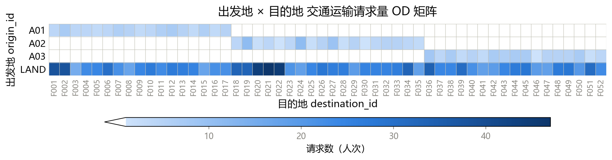

# 问题一：单向出海运输的直升机运载计划编排

## 1. 问题重述

给定 1600 条**出海**需求（`peopleQ1.csv`），每名人员有一个起点（`A01/A02/A03` 或 `LAND`）和终点（`F001`~`F052`）。需编排直升机架次，把人员从陆地机场运送到海上设施。本问**不考虑**最早可登机时间、最晚到达时间和业务性质优先级，且**飞机数量充足**。

要求：在**最小化总飞机使用时间**的基础上，尽可能优化座位利用率、油耗等次要因素，输出 `q1-routes.csv` 与 `q1-assignments.csv`，并报告总飞机使用时间、人员总在途时间、总架次数、总燃油消耗量、座位利用率五项指标。

## 2. 问题本质与建模思路

### 2.1 问题抽象

从运筹学角度看，问题一是一个**多机场、多机型、带容量与燃油约束的单向车辆路径问题**（CVRP 的变体）。与经典 VRP 的差异在于：

1. **单向运送**：架次只执行"机场 → 若干海上设施 → 原机场"的环游，人员只下不上（出海方向），故无需考虑返程载客。
2. **人员不可换乘**：每名人员必须由同一架次从其起点直接送到终点，中途不得换机。
3. **多机型**：T1/T2/T3 的座位数、速度、油耗、航程均不同，机型是决策变量而非固定参数。
4. **燃油约束**：满油起飞、全程剩余油量不低于最低安全余油量，可在 8 个可加油设施中途加油（加满）。
5. **停靠次数上限**：每架次最多 5 次海上着陆（加油停靠也计入着陆次数）。

### 2.2 目标函数的本质

一架次总时间 = 飞行时间 + 停靠时间：

$$
T_r = \frac{d_r^{\text{TSP}}}{v_m} + 10\,|S_r| \;(\text{分钟})
$$

其中 $d_r^{\text{TSP}}$ 为该架次的环游飞行距离（由访问顺序决定），$v_m$ 为机型速度，$|S_r|$ 为海上停靠次数（每次至少 10 分钟，加油为 20 分钟）。

由于设施间平均距离（180 km）**小于**机场到设施的平均距离（254 km），把地理相邻的设施合并进同一个架次能省去多次"机场往返"，这是优化空间所在；而合并受到座位数（≤19）与停靠次数（≤5）的双重约束。因此问题一的本质是：**在容量与航程约束下，对设施进行聚类分组，每组一个架次做 TSP 环游并选机型，使总时间最小**。

## 3. 数据特征与关键洞察

对 `peopleQ1.csv`、`distances.csv` 分析得到以下结论。

### 3.1 需求分布（OD 矩阵）

图 1 为 1600 条出海需求按"出发地 × 目的地"聚合的 OD 矩阵热力图：

由图 1 可见：指定机场的 247 人按"三块"分布（A01→F001~F017、A02→F018~F035、A03→F036~F052），而 `LAND` 的 1353 人均匀覆盖 F001~F052。

| 项目 | 结论 |
|------|------|
| 需求规模 | 1600 人，指定机场 247 人 + `LAND` 1353 人 |
| 设施需求 | 52 个设施全部有需求，每设施 19~51 人，均值 30.8 |
| 机场自然分块 | F001~F017→A01、F018~F035→A02、F036~F052→A03，负载 499/598/503（均衡；编号顺序与海岸线走向一致，各段设施就近其对应机场） |
| 纯就近分配 | A01=944、A02=275、A03=381（严重失衡，不可取） |

### 3.2 机型续航能力

表 1 列出三种机型的续航参数，其中「可用燃油 = 油箱容量 − 最低安全余油量」「最大不加油航程 = 可用燃油 ÷ 油耗」：

| 机型 | 座位数 | 速度(km/h) | 油耗(kg/km) | 油箱容量(kg) | 最低安全余油(kg) | 可用燃油(kg) | 最大不加油航程(km) |
|:----:|:------:|:----------:|:-----------:|:------------:|:----------------:|:------------:|:------------------:|
| T1 | 12 | 250 | 3.4 | 1000 | 150 | 850 | 250 |
| T2 | 16 | 220 | 2.5 | 1150 | 150 | 1000 | 400 |
| T3 | 19 | 190 | 2.9 | 1600 | 200 | 1400 | ≈483 |

由表 1 可知：机场到设施的最近往返距离为 306 km（$2\times 153$），最远往返约 806 km（$2\times 403$）。**全部 52 个设施的单设施往返距离都超过 T1 的 250 km 不加油航程**，即 T1 的每一个出海架次都至少需要一次中途加油。加油分两种情形：

- **目的地即加油点（5 个，单程 ≤250 km）**：F006、F011、F018、F024、F031。T1 可直达目的地加油返回，**无需绕行**，且因速度最快，单架次时间反为三种机型中最短。
- **其余 47 个设施**：目的地非加油点（须绕行至可加油设施），或单程 >250 km（17 个设施 T1 满油飞不到，含 F038、F044、F050 三个远加油点）。

因此 T1 具有两面性：**速度快**（小载客量架次单架次时间最短），但**座位少（12 座）且航程短**（仅 35 个设施单程可达）。T1 不能先验剔除，其合理角色是「小载客量的尾数架次」。表 2 以可加油设施 F011（单程 201 km，需求 29 人）为例：

表 2　F011（需求 29 人）各拆分方案的对比（单架次时间：T1=116.5、T2=129.6、T3=136.9 min）：

| 拆分方案 | 总时间(min) |
|------|:-----------:|
| 纯 T1：12+12+5 | 349.5 |
| 纯 T2：16+13 | 259.2 |
| 纯 T3：19+10 | 273.8 |
| **混合 T3+T1：19+10** | **253.4** |

表 2 说明：纯机型拆分下，T1 因 12 座需 3 架次而最差；但**混合机型拆分**中，29 人拆成「19 人乘 T3、10 人乘 T1」，T1 作为尾数架次速度最快（116.5 min），总时间 253.4 min，反优于纯 T2 的 259.2 min。可见 **T1 并非被支配，应在整数规划中保留为候选机型**，由优化器决定取舍；同类的可加油设施 F024（29 人）最优拆分同样是「10 人 T1 + 19 人 T3」。而 21 个远端设施的往返距离超过 T3 的 483 km 航程，仍须借助可加油设施中途加油。

**关键结论**：

- **T1 保留为候选机型，作为「小载客量尾数架次」**：T1 速度最快（250 km/h），但座位少（12 座）、航程短（仅 35 个设施单程可达）。在混合机型拆分中，T1 可作为 ≤12 人的尾数架次进入最优解——如 F011、F024 各 29 人的最优拆分为「10 人 T1 + 19 人 T3」，优于纯 T2。故模型不应剔除 T1，而应让整数规划在 T1/T2/T3 三种机型中择优。
- **LAND 分配按"分块"固定，不设为决策变量**：纯就近使 A01 过载（944 人），而按编号"三块"划分（F001~F017/F018~F035/F036~F052）既负载均衡（499/598/503）又天然就近。由于三个机场到设施的相对距离优势不明显，优化 LAND 分配的边际收益小，故将 LAND 乘客按设施分块"定死"到对应机场（见 §6.2），使三机场调度彻底解耦。
- **燃油是硬约束**：A03 南端的 F037~F052 距离机场 243~403 km，往返 486~806 km，超出 T3 的 483 km 航程，必须利用可加油设施（F038、F044、F050 等）中途加油。

## 4. 模型假设

1. 人员上下机、地面调度时间忽略不计（题目未给出）。
2. 飞行速度与单位距离油耗不随载客量变化（题目给定）。
3. 忽略机场、设施、加油站的并发容量限制（题目给定）。
4. 停靠时间取最小：不加油 10 分钟、加油 20 分钟；时间向上取整到整数分钟。
5. 距离矩阵对称，且满足三角不等式（实际地理距离，可直接用于 TSP）。

## 5. 符号说明

**集合**

| 符号 | 含义 |
|------|------|
| $\mathcal{A}=\{A01,A02,A03\}$ | 机场集合 |
| $\mathcal{F}=\{F001,\dots,F052\}$ | 海上设施集合，$|\mathcal{F}|=52$ |
| $\mathcal{R}\subset\mathcal{F}$ | 可加油设施集合（8 个） |
| $\mathcal{M}=\{T1,T2,T3\}$ | 机型集合 |

**参数**

| 符号 | 含义 |
|------|------|
| $c_m,\ v_m,\ f_m,\ U_m,\ \underline{u}_m$ | 机型 $m$ 的座位数、速度(km/h)、油耗(kg/km)、油箱容量(kg)、最低安全余油量(kg) |
| $\bar d_m=\dfrac{U_m-\underline{u}_m}{f_m}$ | 机型 $m$ 的最大不加油航程(km) |
| $d_{uv}$ | 节点 $u,v\in\mathcal{A}\cup\mathcal{F}$ 间的距离(km)，对称 |
| $q_d$ | 设施 $d$ 的出海总人数（指定机场 + LAND 合计） |
| $\sigma(d)\in\mathcal{A}$ | 设施 $d$ 的归属机场（按编号分块，见 §6.2） |
| $\mathcal{F}_a=\{d:\sigma(d)=a\}$ | 机场 $a$ 服务的设施集合（分块后固定） |
| $q_{d,a}=q_d\,\mathbb{1}[\sigma(d)=a]$ | 机场 $a$ 服务设施 $d$ 的总人数（固定参数） |

**决策变量**

| 符号 | 含义 |
|------|------|
| $\lambda_r\in\mathbb{Z}_+$ | 架次模式 $r$ 的使用次数 |
| $n_{r,d}\in\{0,\dots,19\}$ | 架次 $r$ 给设施 $d$ 运送的人数 |

**架次与燃油**

| 符号 | 含义 |
|------|------|
| $r$ | 架次（列）索引 |
| $a_r,\ m_r$ | 架次 $r$ 的起飞机场、机型 |
| $S_r\subset\mathcal{F}$ | 架次 $r$ 访问的设施子集，$|S_r|$ 为海上停靠次数（$\le 5$） |
| $d_r^{\text{TSP}}$ | 架次 $r$ 的环游飞行距离(km) |
| $T_r$ | 架次 $r$ 的总时间(min) |
| $s_i,\ u_i$ | 路线第 $i$ 个节点、到达该节点时的剩余油量(kg) |

**列生成与指标**

| 符号 | 含义 |
|------|------|
| $\pi_d$ | 主问题中设施 $d$ 的对偶价格 |
| $\bar c_r$ | 架次 $r$ 的 reduced cost |
| $z_{LP},\ z_{IP}$ | 主问题 LP 松弛下界、整数最优值 |
| $T=\sum_r T_r\lambda_r$ | 总飞机使用时间(min) |
| $\eta$ | 座位利用率 |

## 6. 数学模型

### 6.1 总体框架（可分解性）

架次不跨机场中转、人员不换乘、飞机数量充足，故不同机场的架次**相互独立**。此外，LAND 乘客按 §6.2 的设施分块**固定**归属机场、不再作为决策变量，三个机场的调度因此**彻底解耦**，总问题分解为三个互不相干的机场子问题之和：

$$
\min \sum_{a\in\mathcal{A}} \text{VSP}(a)
$$

其中 $\text{VSP}(a)$ 为机场 $a$ 的航线编排子问题，各子问题独立求解、结果直接相加。

### 6.2 LAND 分块固定分配（预处理）

设施编号 F001~F052 沿海岸线自北向南线性排列，与三个机场的位置分布一致，故按编号分三段即可同时实现"就近"与"均衡"：

$$
\sigma(d)=\begin{cases}
A01, & d\in\{F001,\dots,F017\}\\
A02, & d\in\{F018,\dots,F035\}\\
A03, & d\in\{F036,\dots,F052\}
\end{cases}
$$

设施 $d$ 的全部需求（含指定机场者与 LAND 者）统一由 $\sigma(d)$ 服务，于是各机场的设施集合 $\mathcal{F}_a$ 与人数 $q_{d,a}$ 均为**固定参数**：

$$
\mathcal{F}_a=\{d:\sigma(d)=a\},\qquad
q_{d,a}=\begin{cases}q_d, & \sigma(d)=a\\[2pt] 0, & \text{否则}\end{cases}
$$

三段负载分别为 499/598/503 人，均衡。由于三个机场到海上设施的相对距离优势不明显（编号分块已近似就近），把 LAND 分配设为决策变量带来的边际优化空间很小，故此处**不做分配优化**、直接固定。这一简化放弃了"跨机场重新分配 LAND 乘客"的自由度，其代价与改进方案见 §10。

### 6.3 航线编排子模型 $\text{VSP}(a)$（集合划分形式）

**候选架次** $r$ 由五元组确定：起飞机场 $a_r$、机型 $m_r$、访问设施子集 $S_r$（$|S_r|\le 5$）、各设施运送人数 $\{n_{r,d}\}_{d\in S_r}$、访问顺序（即 TSP 环游）。架次可行当且仅当：

$$
\sum_{d\in S_r} n_{r,d}\le c_{m_r}\qquad(\text{容量})
$$

$$
|S_r|\le 5\qquad(\text{停靠次数})
$$

$$
\text{环游满足燃油约束（§6.4）}
$$

架次总时间 $T_r=\dfrac{d_r^{\text{TSP}}}{v_{m_r}}+10\,|S_r|$（有加油停靠时对应停靠按 20 分钟计）。引入决策 $\lambda_r\in\mathbb{Z}_+$（架次模式 $r$ 的使用次数，同一模式可重复执行），则子问题为：

$$
\min \sum_{r} T_r\,\lambda_r
$$

$$
\text{s.t.}\quad \sum_{r:\,d\in S_r} n_{r,d}\,\lambda_r = q_{d,a},\quad \forall d\in\mathcal{F}
$$

$$
\lambda_r\in\mathbb{Z}_+
$$

该模型允许同一设施的需求被拆分到多个架次（split delivery），对应"每设施 19~51 人超过单机座位"的实际情况。由于候选架次（机型 $\times$ 设施子集 $\times$ 人数分配）数量随设施数指数增长，无法显式枚举，§7 采用列生成隐式枚举。

### 6.4 燃油约束

对架次 $r$（路线 $a=s_0\to s_1\to\cdots\to s_k\to s_{k+1}=a$），起飞满油 $u_0=U_m$，逐站递推：

$$
u_i = \begin{cases}
U_m, & \text{若在 } s_i \text{ 加油且 } s_i\in\mathcal{R}\\
u_{i-1}-f_m\, d_{s_{i-1},s_i}, & \text{否则}
\end{cases}
$$

约束为所有节点剩余油量不低于安全余油：

$$
u_i\ge \underline{u}_m,\quad i=1,\dots,k+1
$$

等价地，任意两相邻加油停靠之间的飞行距离不得超过 $\bar d_m$。$\bar d_{\text{T1}}=250$ km、$\bar d_{\text{T2}}=400$ km、$\bar d_{\text{T3}}=483$ km。对环游距离超 $\bar d_m$ 的架次，须在 $\mathcal{R}$ 中选取加油点插入路线，且加油停靠占用停靠次数配额。

## 7. 求解算法

### 7.1 总体框架：列生成

解耦后对每个机场独立求解 §6.3 的集合划分整数规划。候选架次数量随设施数指数增长（≤5 个设施一组的子集已达 $C_{32}^{5}\approx 2\times10^{5}$，再乘人数分配与机型更是天文数字），无法显式枚举，故采用**列生成（Column Generation）**隐式枚举所有有效架次：

1. **限制主问题（RMP）**：从初始列池出发，求解 §6.3 的 LP 松弛（$\lambda_r\ge 0$），得到当前最优解与对偶价格。
2. **定价子问题（Pricing）**：以对偶价格为参数求 reduced cost 最小的新列，若为负则加入列池并回到 1，否则当前 LP 已达最优。
3. **整数化**：对 LP 解分支（分支定价）或舍入修复，得到整数排班。

### 7.2 主问题（RMP）

以「1 人份」视角处理 split-delivery：同设施人员可互换，故主问题采用**设施级约束**，一列 $r$ 携带整数人数向量 $\{n_{r,d}\}$，决策 $\lambda_r\in\mathbb{Z}_+$：

$$
\min \sum_r T_r\,\lambda_r
\qquad\text{s.t.}\qquad
\sum_r n_{r,d}\,\lambda_r = q_{d,a}\ (\forall d),\quad \lambda_r\ge 0
$$

### 7.3 定价子问题（ESPPRC）

设对偶价格为 $\pi_d$，一列 $r$ 的 reduced cost 为

$$
\bar c_r = T_r - \sum_{d\in S_r}\pi_d\, n_{r,d}
$$

定价子问题求 $\bar c_r$ 最小的一条架次路线：从机场出发，访问若干设施（$\le 5$ 个）、取走若干人（$\sum n_{r,d}\le c_m$）、满足燃油约束并返回机场。这是**带资源约束的最短路径问题（ESPPRC）**，用 label-setting 动态规划求解，标签记录 $(\text{当前设施},\ \text{已载人数},\ \text{已停靠设施数},\ \text{已访问设施位掩码})$，资源为容量（人数 $\le$ 座数）与停靠次数（$\le 5$）。

对机型 $m\in\{T1,T2,T3\}$ 各求解一次定价子问题（容量资源 $c_m$、速度 $v_m$），所得列一并进入主问题混选；T1 航程短（单程 ≤250 km 且加油点可达）作为定价子问题的可达性限制处理。

### 7.4 燃油约束的后置处理

燃油不并入定价子问题（加油点引入油量状态会使 ESPPRC 显著复杂化），而采用**后置可行性检查**：定价生成路线后校验「相邻两加油停靠间飞行距离 $\le \bar d_m$」（§6.4）；超航程者就近在 $\mathcal{R}$ 中插入加油点（加油停靠 20 min、计入停靠配额），仍不可行则弃列。

### 7.5 整数化与 gap

- **下界**：RMP 的 LP 最优值 $z_{LP}$ 为整数最优值 $z_{IP}$ 的下界。
- **整数解**：以 LP 解为基础，对 $\lambda_r$ 分支（配合列生成即**分支定价**），或「舍入 + 局部修复」；取更优者为上界。
- **gap**：$\text{gap}=\dfrac{z_{IP}-z_{LP}}{z_{LP}}$。

### 7.6 初始列池

初始列池由启发式生成（如每个设施拆成 $\lceil q_{d,a}/19\rceil$ 个单设施架次），保证 RMP 初始可行。

## 8. 评价指标

1. **总飞机使用时间** $T=\sum_r T_r\lambda_r$（主目标）。
2. **人员总在途时间**：每名人员自所乘飞机离场至抵达终点的时长（含途中绕行与停靠等待）之和。
3. **总架次数** $=|\{r:y_r=1\}|$。
4. **总燃油消耗量** $=\sum_r\sum_{\text{seg}} f_{m_r} d_{\text{seg}}$。
5. **座位利用率**：

$$
\eta = \frac{\sum_{r}\sum_{\text{seg}\in r} (\text{pax}_{\text{seg}}\cdot d_{\text{seg}})}
{\sum_{r}\sum_{\text{seg}\in r} (c_{m_r}\cdot d_{\text{seg}})}
$$

## 9. 可行性下界（参考）

- **架次数下界**：$\lceil 1600/19\rceil=85$（全部 T3 满座）。
- **停靠时间下界**：$52\times 10=520$ 分钟（每个设施至少停靠一次）。
- **飞行距离下界**：忽略合并收益，每设施至少往返一次其最近机场 $\sum_d 2\min_a d_{a,d}$；实际最优因设施合并会低于此值，故仅作量级参考。

上述为简单下界；更紧的下界由列生成的 LP 松弛给出（见 §7.5），gap = (整数解 − 下界)/下界。

## 10. 不足与改进

### 10.1 本文的不足：LAND 分配被固定

本文把 LAND 乘客按设施分块"定死"到机场（§6.2），放弃了把机场分配作为决策变量的自由度。当不同机场到同一设施的距离差异显著、或设施布局不规则时，固定分块可能带来损失：部分设施的 LAND 乘客被分给非最近机场而增加往返距离；分块若造成三机场负载不均，则某机场架次增多、满载率下降。

### 10.2 改进方向：LAND 分配作为决策变量的整体联合优化

更精细的建模是把 LAND 分配纳入决策。记 $q_d^{\text{LAND}}$ 为设施 $d$ 中起点为 `LAND` 的人数、$q_{d,a}^{\text{fix}}$ 为其中指定机场 $a$ 的人数，引入整数变量 $z_{d,a}$（设施 $d$ 的 LAND 乘客分给机场 $a$ 的人数），满足

$$
\sum_{a\in\mathcal{A}} z_{d,a}=q_d^{\text{LAND}},\quad \forall d,\qquad z_{d,a}\in\mathbb{Z}_+
$$

机场 $a$ 服务设施 $d$ 的总人数变为 $q_{d,a}=q_{d,a}^{\text{fix}}+z_{d,a}$（§6.2 的分块固定是其 $z_{d,a}=0$ 时的特例）。此时三个机场通过 $z_{d,a}$ 相互耦合，须把 $\min\sum_a\text{VSP}(a)$ 与上述分配约束合并为**一个整体整数规划**，并用列生成联合求解（主问题含全部设施约束，定价子问题为 ESPPRC，框架同 §7），必要时对 $z_{d,a}$ 与 $\lambda_r$ 一并分支（分支定价）。

### 10.3 本文不采用的原因

三个机场到海上设施的相对距离优势不明显——设施沿海岸线线性编号、各段设施就近其对应机场，分块解（499/598/503）已负载均衡且接近最优；联合优化的边际收益小，而耦合使列生成与分支定价的规模与实现复杂度显著上升。故在竞赛时间窗口内取"分块固定"的简化路线，整体联合优化留作后续改进。
